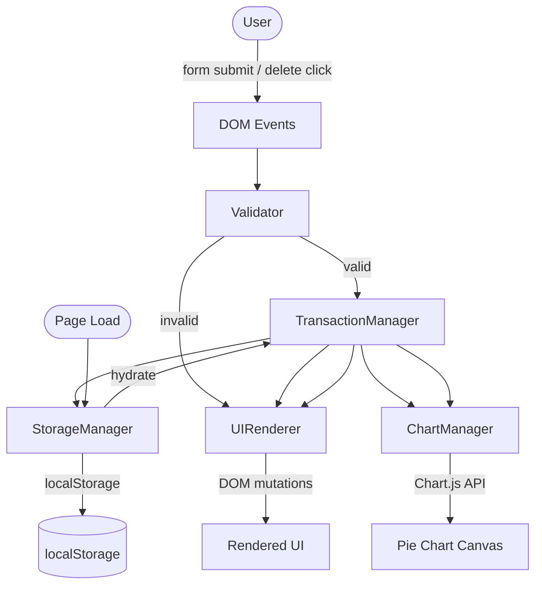
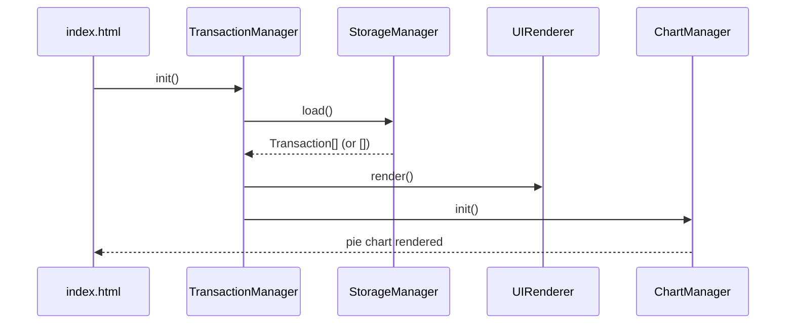
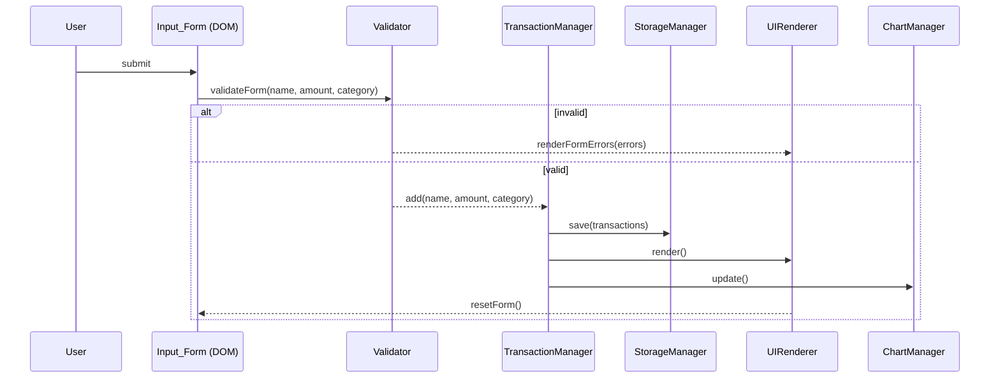

# Design Document

## Expense and Budget Visualizer

---

## Overview

The Expense and Budget Visualizer is a fully client-side single-page application (SPA) built with HTML, CSS, and vanilla JavaScript. It lets users record expense transactions, view a running total balance, browse a categorized transaction list, and see a live pie chart of spending by category — all without a server, build step, or external runtime dependency beyond Chart.js loaded via CDN.

All state is persisted in the browser's `localStorage`. The app is self-contained in three files:

| File | Role |
|---|---|
| `index.html` | Markup, CDN script tags, structural skeleton |
| `css/styles.css` | All visual styling, responsive breakpoints |
| `js/app.js` | All application logic, split into five manager modules |

The app works as a standalone web page opened directly from the filesystem (`file://`) or served over HTTP, and is also compatible with the browser extension model (no server-side requirements).

---

## Architecture

The application follows a **layered, event-driven architecture** with a clear separation between data management, validation, rendering, and chart management. There is no framework; coordination happens through direct function calls triggered by DOM events.



### Key Design Decisions

**No framework, no build step.** The constraint is a feature: the app loads instantly from any origin, including `file://`, and works as a browser extension without a manifest-declared background service worker or bundler.

**Single source of truth in memory.** `TransactionManager` holds the canonical in-memory array of transactions. `StorageManager` is a pure persistence layer — it serializes/deserializes but never owns state. `UIRenderer` and `ChartManager` are pure output layers — they read from `TransactionManager` and write to the DOM/canvas.

**Synchronous render cycle.** Every mutation (add/delete) follows the same pipeline: validate → mutate in-memory → persist → re-render UI → re-render chart. This keeps the UI always consistent with storage.

**Chart.js via CDN.** Chart.js is loaded from a CDN `<script>` tag in `index.html`. `ChartManager` wraps the Chart.js instance and exposes only `init()` and `update()` to the rest of the app, isolating the dependency.

---

## Components and Interfaces

### StorageManager

Responsible for reading and writing the transaction array to `localStorage`. It is a stateless utility — it does not cache data.

```js
StorageManager = {
  // Returns parsed array of transactions, or [] on error/missing key.
  // Logs a console warning and triggers a UI warning on malformed data.
  load(): Transaction[],

  // Serializes transactions array to JSON and writes to localStorage.
  // Returns true on success, false if localStorage is unavailable.
  save(transactions: Transaction[]): boolean,

  STORAGE_KEY: 'expense_transactions'  // constant key name
}
```

**Error handling:** If `localStorage.getItem` throws (e.g., security restriction) or `JSON.parse` throws (malformed data), `load()` catches the error, returns `[]`, and sets a flag that `UIRenderer` reads to display a non-blocking warning banner.

---

### TransactionManager

Owns the in-memory transaction array. Coordinates between `StorageManager`, `UIRenderer`, and `ChartManager` after every mutation.

```js
TransactionManager = {
  transactions: Transaction[],  // in-memory state

  // Loads from storage, populates this.transactions.
  init(): void,

  // Creates a new Transaction, pushes to array, persists, re-renders.
  add(name: string, amount: number, category: string): Transaction,

  // Removes transaction by id, persists, re-renders.
  delete(id: string): void,

  // Returns sum of all transaction amounts.
  getTotal(): number,

  // Returns { Food: number, Transport: number, Fun: number }
  // with 0 for categories with no transactions.
  getTotalsByCategory(): CategoryTotals
}
```

---

### Validator

Pure functions — no side effects. Returns structured result objects so `UIRenderer` can display targeted inline errors.

```js
Validator = {
  // Returns { valid: boolean, errors: { name?, amount?, category? } }
  validateForm(name: string, amount: string, category: string): ValidationResult
}

// Types:
ValidationResult = {
  valid: boolean,
  errors: {
    name?: string,      // e.g. "Item name is required"
    amount?: string,    // e.g. "Amount must be a positive number"
    category?: string   // e.g. "Please select a category"
  }
}
```

Validation rules:
- `name`: must be non-empty after trimming whitespace
- `amount`: must parse as a finite positive number (`> 0`)
- `category`: must be one of `['Food', 'Transport', 'Fun']`

---

### UIRenderer

Handles all DOM mutations. Reads from `TransactionManager` to produce the current view. Never stores state itself.

```js
UIRenderer = {
  // Renders the full transaction list from TransactionManager.transactions.
  // Shows empty-state message when array is empty.
  renderTransactionList(): void,

  // Updates the balance display element with TransactionManager.getTotal().
  renderBalance(): void,

  // Displays inline validation errors next to form fields.
  // Clears previous errors before rendering new ones.
  renderFormErrors(errors: ValidationResult['errors']): void,

  // Clears all inline form errors.
  clearFormErrors(): void,

  // Resets all form fields to default empty state.
  resetForm(): void,

  // Shows a non-blocking warning banner (e.g., localStorage unavailable).
  showWarning(message: string): void,

  // Hides the warning banner.
  hideWarning(): void,

  // Full re-render: calls renderTransactionList() + renderBalance().
  render(): void
}
```

---

### ChartManager

Wraps the Chart.js instance. Exposes only `init()` and `update()`.

```js
ChartManager = {
  chart: Chart | null,  // Chart.js instance

  // Creates the Chart.js pie chart on the <canvas> element.
  // Called once on page load after TransactionManager.init().
  init(): void,

  // Destroys and recreates the chart with current data from
  // TransactionManager.getTotalsByCategory().
  // Shows placeholder text on canvas when no transactions exist.
  update(): void,

  // Category → hex color mapping (consistent, hardcoded)
  COLORS: { Food: '#FF6384', Transport: '#36A2EB', Fun: '#FFCE56' }
}
```

**Rationale for destroy/recreate:** Chart.js `update()` can leave stale dataset state when categories drop to zero. Destroy/recreate on every mutation is simpler and imperceptible at this data scale.

---

### Initialization Flow



---

### Add Transaction Flow



---

## Data Models

### Transaction

```js
{
  id: string,         // crypto.randomUUID() or Date.now().toString() fallback
  name: string,       // item name, trimmed, non-empty
  amount: number,     // positive float, stored as number (not string)
  category: string,   // 'Food' | 'Transport' | 'Fun'
  timestamp: number   // Date.now() at creation time (ms since epoch)
}
```

### CategoryTotals

```js
{
  Food: number,       // sum of amounts for Food transactions (0 if none)
  Transport: number,  // sum of amounts for Transport transactions (0 if none)
  Fun: number         // sum of amounts for Fun transactions (0 if none)
}
```

### localStorage Schema

```
Key:   "expense_transactions"
Value: JSON.stringify(Transaction[])
```

Example stored value:
```json
[
  { "id": "1700000000000", "name": "Lunch", "amount": 12.50, "category": "Food", "timestamp": 1700000000000 },
  { "id": "1700000001000", "name": "Bus pass", "amount": 45.00, "category": "Transport", "timestamp": 1700000001000 }
]
```

**Serialization invariant:** Every field present in the in-memory `Transaction` object is serialized to JSON and must survive a round-trip through `JSON.stringify` → `localStorage.setItem` → `localStorage.getItem` → `JSON.parse` with identical values (modulo floating-point representation, which is preserved by JSON for finite numbers).

---

## Correctness Properties

*A property is a characteristic or behavior that should hold true across all valid executions of a system — essentially, a formal statement about what the system should do. Properties serve as the bridge between human-readable specifications and machine-verifiable correctness guarantees.*


### Property 1: Validator correctness

*For any* combination of name, amount string, and category values, `Validator.validateForm()` SHALL return `valid: true` if and only if the name is non-empty after trimming, the amount parses as a finite positive number, and the category is one of `['Food', 'Transport', 'Fun']`. For any input that fails at least one of these conditions, it SHALL return `valid: false` with a non-empty `errors` object identifying the failing field(s).

**Validates: Requirements 1.3**

---

### Property 2: Add grows the transaction list

*For any* valid transaction input (non-empty name, positive amount, valid category), calling `TransactionManager.add()` SHALL result in the transaction list containing exactly one more entry than before, and that entry SHALL have the same name, amount, and category as the input.

**Validates: Requirements 1.2, 2.1, 2.3**

---

### Property 3: Invalid input leaves the list unchanged

*For any* input that `Validator.validateForm()` classifies as invalid, the transaction list SHALL have the same length and contents before and after the attempted add operation.

**Validates: Requirements 1.4**

---

### Property 4: Delete removes the entry from list and storage

*For any* non-empty transaction list and any transaction `t` in that list, calling `TransactionManager.delete(t.id)` SHALL result in `t` being absent from `TransactionManager.transactions` AND absent from the array returned by `StorageManager.load()`.

**Validates: Requirements 2.4, 5.2**

---

### Property 5: Balance equals the arithmetic sum

*For any* array of transactions (including the empty array), `TransactionManager.getTotal()` SHALL return a value equal to the sum of all `amount` fields. For the empty array, the result SHALL be `0`.

**Validates: Requirements 3.1, 3.4**

---

### Property 6: Category totals are correct

*For any* array of transactions, `TransactionManager.getTotalsByCategory()` SHALL return an object where each category's value equals the sum of `amount` for all transactions in that category, and categories with no transactions SHALL have a value of `0`.

**Validates: Requirements 4.1, 4.4**

---

### Property 7: Storage round-trip preserves transaction data

*For any* array of `Transaction` objects, calling `StorageManager.save(transactions)` followed by `StorageManager.load()` SHALL return an array that is deeply equal to the original — same length, same `id`, `name`, `amount`, `category`, and `timestamp` values for each entry, in the same order.

**Validates: Requirements 5.1, 5.3**

---

## Error Handling

### localStorage Unavailability

`StorageManager.load()` wraps all `localStorage` access in a `try/catch`. If `localStorage` is unavailable (e.g., private browsing with storage blocked, browser security policy) or returns malformed JSON, the method:
1. Returns an empty array `[]`
2. Sets an internal `storageError` flag
3. `UIRenderer.showWarning()` is called during `init()` if the flag is set, displaying a non-blocking banner: *"Your data could not be loaded. Storage may be unavailable."*

`StorageManager.save()` also wraps writes in `try/catch`. On failure it returns `false` and the caller (`TransactionManager`) calls `UIRenderer.showWarning()` with: *"Your data could not be saved. Changes may be lost."*

### Form Validation Errors

`Validator.validateForm()` returns a structured `ValidationResult`. `UIRenderer.renderFormErrors()` maps each error key to the corresponding form field and inserts an inline `<span class="error">` element adjacent to the field. All previous error spans are cleared before rendering new ones to avoid duplication.

### Malformed Transaction Data

On `StorageManager.load()`, after `JSON.parse`, each item in the array is checked for the presence of required fields (`id`, `name`, `amount`, `category`, `timestamp`). Items missing required fields are silently filtered out. If the parsed value is not an array, the entire result is treated as malformed and `[]` is returned with a warning.

### Chart.js Unavailability

If the Chart.js CDN script fails to load (network error), `ChartManager.init()` checks for `window.Chart` before proceeding. If absent, it logs a console error and renders a static text fallback inside the `<canvas>` container: *"Chart unavailable — please check your internet connection."*

---

## Testing Strategy

> **Note:** Per project constraints, no test files or test setup are included in this project. The testing strategy below documents the intended verification approach for correctness properties and is provided for reference only.

### Approach

The app's logic is organized into pure or near-pure functions (`Validator.validateForm`, `TransactionManager.getTotal`, `TransactionManager.getTotalsByCategory`, `StorageManager.save`/`load`) that are well-suited to automated testing. The UI rendering and chart layers are DOM/canvas-dependent and are best verified through manual testing or browser-based integration tests.

### Unit Tests (if implemented)

Focus on the pure logic layer:

- **Validator**: Example-based tests for each validation rule (empty name, zero amount, negative amount, non-numeric amount, missing category, all valid).
- **TransactionManager.getTotal**: Example tests for empty array, single transaction, multiple transactions, floating-point amounts.
- **TransactionManager.getTotalsByCategory**: Example tests for single category, all three categories, empty array.
- **StorageManager**: Mock `localStorage` to test load/save round-trip, malformed JSON handling, and unavailability.

### Property-Based Tests (if implemented)

If a property-based testing library is added (e.g., [fast-check](https://github.com/dubzzz/fast-check) for JavaScript), the seven correctness properties above map directly to property tests:

- **Property 1** — Generate arbitrary `(name, amount, category)` triples; assert validator output matches expected validity.
- **Property 2** — Generate valid transaction inputs; assert list grows by 1 and contains the new entry.
- **Property 3** — Generate invalid inputs; assert list is unchanged.
- **Property 4** — Generate non-empty transaction lists; pick a random entry; assert it is absent after delete.
- **Property 5** — Generate arbitrary transaction arrays; assert `getTotal()` equals `array.reduce((s, t) => s + t.amount, 0)`.
- **Property 6** — Generate arbitrary transaction arrays; assert `getTotalsByCategory()` matches per-category sums.
- **Property 7** — Generate arbitrary transaction arrays; assert `load(save(arr))` deep-equals `arr`.

Each property test should run a minimum of 100 iterations. Tag format: `Feature: expense-budget-visualizer, Property N: <property_text>`.

### Manual / Integration Testing

- **Responsive layout**: Resize browser to verify 2-col ↔ 1-col breakpoint at 600px.
- **Empty states**: Delete all transactions; verify empty state message and chart placeholder.
- **Persistence**: Add transactions, reload page; verify data is restored.
- **Cross-browser**: Open in Chrome, Firefox, Edge, Safari; verify no console errors.
- **localStorage blocked**: Open in a context where storage is blocked; verify warning banner appears and app still loads.
- **Chart.js CDN failure**: Block the CDN request; verify fallback message appears.
